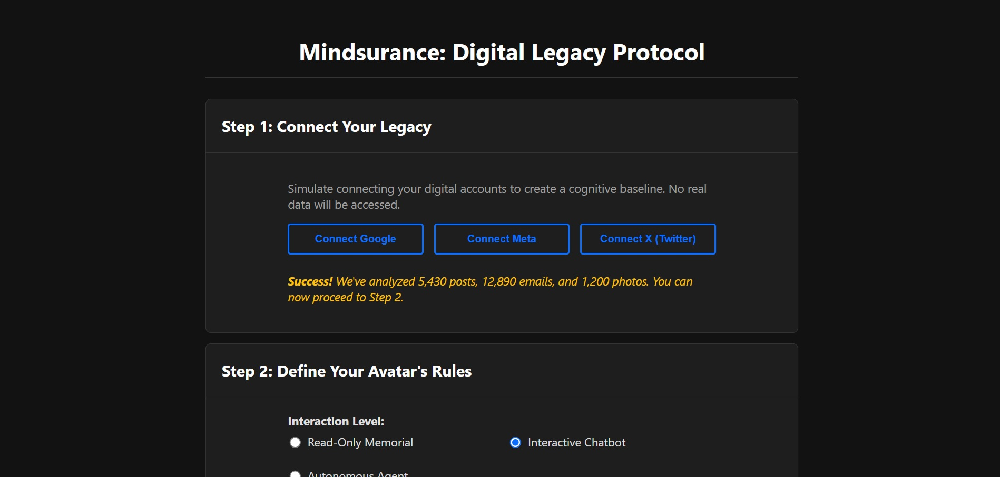

# DLP: Digital Legacy Protocol

*A Mindsurance Hackathon Prototype*

**DLP is a full-stack web application that allows users to create a "Digital Will" for their posthumous AI avatar, securing their digital identity after they're gone.**

This prototype demonstrates a future where our digital legacy is respected, not exploited. Users can define the rules of engagement for their future AI persona, secure these rules in a simulated blockchain ledger, and interact with an AI that is verifiably bound by their wishes.

 


## The Problem

Our digital footprints are immortal, but our intentions for them are not. After we pass away, our data is controlled by corporations, and our digital personas could be misused or commercialized without consent. DLP provides a solution for a secure and user-controlled digital afterlife.

## Features

- **Simulated Onboarding:** A clear demonstration of how a user's data from platforms like Google or Meta could be used to create a "cognitive baseline."
- **Immutable Rules:** A detailed interface to define the avatar's behavior, including interaction levels, permitted topics, and commercial use policies.
- **Blockchain Simulation:** User-defined rules are hashed and recorded in a "Transaction Log," providing a powerful visual metaphor for an immutable smart contract.
- **Rule-Bound AI:** A live chatbot demonstrates the protocol in action. Ask it about a forbidden topic, and it will politely refuse, proving the user's rules are being enforced.

## Tech Stack

- **Backend:** Python (Flask), `flask-cors`
- **Core Logic:** Python
- **Frontend:** HTML5, JavaScript (vanilla)
- **Styling:** [Pico.css](https://picocss.com/) (lightweight CSS framework for a clean, dark-mode UI)
- **Database:** In-memory Python dictionary (for hackathon purposes)

## How to Run This Project

### Prerequisites

- [Python 3.6+](https://www.python.org/downloads/)
- `pip` (Python package installer)

### Installation & Setup

1.  **Clone the repository or download the files.**
    Place all the files (`app.py`, `core_logic.py`, `index.html`, `style.css`) into a single folder.

2.  **Navigate to the project directory** in your terminal:
    ```bash
    cd path/to/mindsurance_hackathon
    ```

3.  **Install the required Python packages:**
    ```bash
    pip install -r requirements.txt
    ```
    *(**Note:** If you don't have a `requirements.txt` file, you can install them manually):*
    ```bash
    pip install Flask flask-cors
    ```

### Running the Application

1.  **Start the Flask backend server:**
    ```bash
    python app.py
    ```
    The server will start running on `http://127.0.0.1:5000`. Keep this terminal window open.

2.  **Open the user interface:**
    Navigate to the project folder on your computer and open the `index.html` file directly in your web browser (e.g., Chrome, Firefox).

3.  **Interact with the app!**
    You can now use the web interface to connect accounts, define rules, mint a "Digital Will," and chat with the AI avatar.

## Project Structure